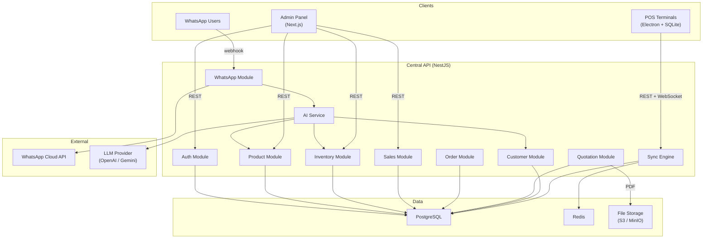
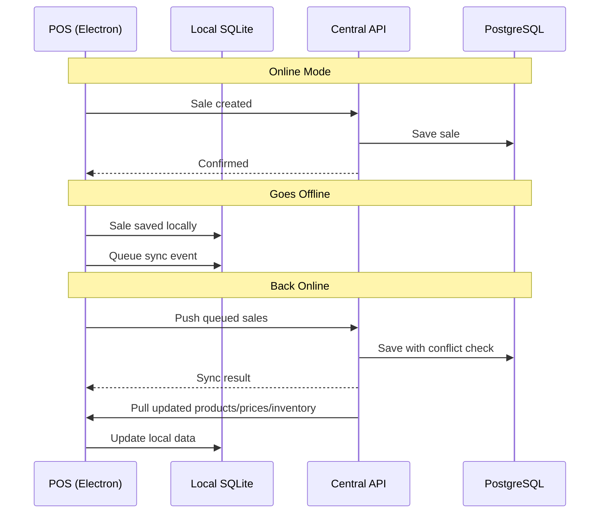
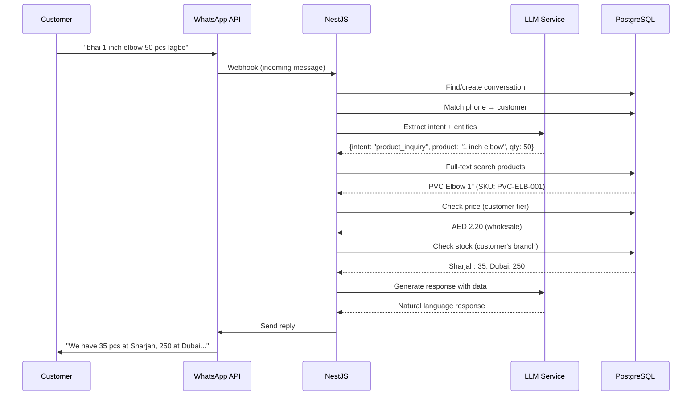

# DevsFleet Business Platform — Implementation Plan

A multi-tenant, multi-branch, offline-first business platform combining POS, WhatsApp AI, and Admin Panel — built for hardware/electrical/sanitary/paint retail businesses starting with your own 5,000+ product catalog.

---

## User Review Required

> [!IMPORTANT]
> **Product Price List Upload Pending** 
> The database schema for Products, Pricing, and Categories will be finalized *after* analyzing your actual Excel/CSV product list. The schema below is the architectural skeleton — column names, category hierarchy, and attribute structure will be adapted to match your real data.

> [!IMPORTANT]
> **Multi-Tenancy Decision** // also add RLS in postgresql
> The plan includes `tenant_id` from day one. This means every major table is scoped to a tenant. Your business becomes Tenant #1. Confirm you want this — it adds ~10% complexity but makes the platform sellable later.

> [!WARNING]
> **Offline POS Technology Choice**
> The plan uses **Electron + SQLite** for the offline POS client. Alternative: a **PWA with IndexedDB**. Electron gives native barcode scanner support, receipt printer drivers, and true offline SQLite. PWA is lighter but weaker on hardware integration. **Which do you prefer?**

> [!IMPORTANT]
> **WhatsApp Business API Provider**
> You'll need a WhatsApp Business API provider. Options: **Meta Cloud API** (free, self-managed), **Twilio**, **360dialog**, **WATI**, or **Interakt**. Which provider are you planning to use, or should I design for Meta Cloud API (most flexible, no per-message vendor fee)? //meta cloud api

---

## Open Questions

1. **Currency**: Is everything in AED? Or do you need multi-currency support? // I need multicurrency in future so leave some space
2. **Tax/VAT**: UAE has 5% VAT. Should the system handle tax-inclusive and tax-exclusive pricing? // vat will be configarable tannent to tannent in tannent settings
3. **Receipt Printer**: What thermal printer model? (80mm / 58mm? USB / Bluetooth / Network?) // i might need all also a4 size
4. **Barcode Scanner**: USB HID scanner? Or camera-based?
5. **Number of POS terminals per branch**: Affects offline stock allocation strategy. // minimum 2
6. **Customer credit/balance**: Do you extend credit to wholesale customers? If so, what's the workflow — credit limit, payment terms, partial payments? // I might give credit to customers not only wholesale, whoever I see fit. there will be creadit limit which will be configarable per customer, 
7. **Product images**: Do you need product images in the system, or is text/barcode sufficient for POS? //ea I need product image, also make sure no duplicate image is not publish,
8. **Languages**: English only? Or English + Arabic + Hindi/Urdu for WhatsApp? //english, arabic, hindi/urdu, bangla

9. **Deployment**: Self-hosted VPS (e.g., Hetzner, DigitalOcean) or cloud (AWS/GCP)? // self-hosted vps

10. **Domain**: Do you have a domain for the platform? //yea i have pos.devsfleet.com


---

## High-Level Architecture



---

## Tech Stack

| Layer | Technology | Rationale |
|-------|-----------|-----------|
| **API Server** | NestJS (TypeScript) | Modular, typed, great for complex business logic |
| **Database** | PostgreSQL 18 | ACID, JSON support, full-text search, rock-solid |
| **ORM** | drizzle orm | Type-safe, migration-friendly, great DX |
| **Cache / Queue** | Redis + BullMQ | Session cache, job queues, pub/sub for sync |
| **POS Client** | Electron + React + SQLite | True offline, native hardware access |
| **Admin Panel** | Next.js 16 (App Router) | SSR, fast, same language as backend |
| **File Storage** | MinIO (self-hosted S3) | PDFs, receipts, product images |
| **WhatsApp** | Meta Cloud API | Direct, no vendor lock-in |
| **AI/LLM** | OpenAI GPT-4o / Gemini | Intent extraction, natural language |
| **Auth** | JWT + Refresh Tokens | Stateless, works offline |
| **PDF** | Puppeteer / @react-pdf | Quotations, invoices |
| **Monorepo** | Turborepo + pnpm | Shared types, single repo |

---

## Project Structure

```text
devsfleet/
├── apps/
│   ├── api/                    # NestJS backend
│   │   ├── src/
│   │   │   ├── modules/
│   │   │   │   ├── auth/
│   │   │   │   ├── tenants/
│   │   │   │   ├── branches/
│   │   │   │   ├── users/
│   │   │   │   ├── products/
│   │   │   │   ├── categories/
│   │   │   │   ├── inventory/
│   │   │   │   ├── customers/
│   │   │   │   ├── suppliers/
│   │   │   │   ├── purchases/
│   │   │   │   ├── pricing/
│   │   │   │   ├── quotations/
│   │   │   │   ├── orders/
│   │   │   │   ├── sales/
│   │   │   │   ├── payments/
│   │   │   │   ├── cash-register/
│   │   │   │   ├── sync/
│   │   │   │   ├── whatsapp/
│   │   │   │   ├── ai/
│   │   │   │   └── reports/
│   │   │   ├── common/
│   │   │   │   ├── guards/
│   │   │   │   ├── interceptors/
│   │   │   │   ├── decorators/
│   │   │   │   ├── filters/
│   │   │   │   └── pipes/
│   │   │   └── config/
│   │   └── prisma/
│   │       ├── schema.prisma
│   │       └── migrations/
│   │
│   ├── admin/                  # Next.js admin panel
│   │   ├── app/
│   │   │   ├── (auth)/
│   │   │   ├── (dashboard)/
│   │   │   │   ├── products/
│   │   │   │   ├── inventory/
│   │   │   │   ├── sales/
│   │   │   │   ├── customers/
│   │   │   │   ├── orders/
│   │   │   │   ├── reports/
│   │   │   │   ├── branches/
│   │   │   │   ├── settings/
│   │   │   │   └── whatsapp/
│   │   │   └── layout.tsx
│   │   └── components/
│   │
│   └── pos/                    # Electron POS client
│       ├── electron/
│       │   ├── main.ts
│       │   ├── preload.ts
│       │   ├── sync/
│       │   │   ├── sync-engine.ts
│       │   │   ├── conflict-resolver.ts
│       │   │   └── queue.ts
│       │   ├── hardware/
│       │   │   ├── printer.ts
│       │   │   ├── scanner.ts
│       │   │   └── cash-drawer.ts
│       │   └── db/
│       │       ├── sqlite.ts
│       │       └── migrations/
│       └── src/                # React UI
│           ├── pages/
│           │   ├── Login.tsx
│           │   ├── POS.tsx
│           │   ├── CashRegister.tsx
│           │   ├── Returns.tsx
│           │   └── Settings.tsx
│           └── components/
│
├── packages/
│   ├── shared-types/           # Shared TypeScript types
│   │   └── src/
│   ├── shared-utils/           # Shared utilities
│   │   └── src/
│   └── db-schema/              # Prisma schema (shared)
│       └── prisma/
│
├── tools/
│   └── import/                 # Excel/CSV product importer
│       └── import-products.ts
│
├── docker-compose.yml
├── turbo.json
├── pnpm-workspace.yaml
└── package.json
```

---

## Database Schema (Core Tables)

> [!NOTE]
> Column details for `products` will be finalized after analyzing your Excel price list. The schema below covers the structural architecture.

### Tenant & Branch Layer

```sql
-- Multi-tenancy root
CREATE TABLE tenants (
    id              UUID PRIMARY KEY DEFAULT gen_random_uuid(),
    name            VARCHAR(255) NOT NULL,
    slug            VARCHAR(100) UNIQUE NOT NULL,
    settings        JSONB DEFAULT '{}',
    is_active       BOOLEAN DEFAULT true,
    created_at      TIMESTAMPTZ DEFAULT now(),
    updated_at      TIMESTAMPTZ DEFAULT now()
);

CREATE TABLE branches (
    id              UUID PRIMARY KEY DEFAULT gen_random_uuid(),
    tenant_id       UUID NOT NULL REFERENCES tenants(id),
    name            VARCHAR(255) NOT NULL,
    code            VARCHAR(20) UNIQUE NOT NULL,       -- e.g., "DXB", "SHJ"
    address         TEXT,
    phone           VARCHAR(20),
    is_active       BOOLEAN DEFAULT true,
    settings        JSONB DEFAULT '{}',
    created_at      TIMESTAMPTZ DEFAULT now(),
    updated_at      TIMESTAMPTZ DEFAULT now()
);
```

### Auth & Users

```sql
CREATE TABLE roles (
    id              UUID PRIMARY KEY DEFAULT gen_random_uuid(),
    tenant_id       UUID NOT NULL REFERENCES tenants(id),
    name            VARCHAR(100) NOT NULL,             -- admin, manager, cashier, warehouse
    permissions     JSONB NOT NULL DEFAULT '[]',
    created_at      TIMESTAMPTZ DEFAULT now()
);

CREATE TABLE users (
    id              UUID PRIMARY KEY DEFAULT gen_random_uuid(),
    tenant_id       UUID NOT NULL REFERENCES tenants(id),
    branch_id       UUID REFERENCES branches(id),      -- NULL = access to all branches
    role_id         UUID NOT NULL REFERENCES roles(id),
    name            VARCHAR(255) NOT NULL,
    email           VARCHAR(255),
    phone           VARCHAR(20),
    pin             VARCHAR(10),                        -- Quick POS login
    password_hash   VARCHAR(255) NOT NULL,
    is_active       BOOLEAN DEFAULT true,
    created_at      TIMESTAMPTZ DEFAULT now(),
    updated_at      TIMESTAMPTZ DEFAULT now()
);
```

### Product Catalog

```sql
CREATE TABLE categories (
    id              UUID PRIMARY KEY DEFAULT gen_random_uuid(),
    tenant_id       UUID NOT NULL REFERENCES tenants(id),
    parent_id       UUID REFERENCES categories(id),    -- Hierarchical
    name            VARCHAR(255) NOT NULL,
    slug            VARCHAR(255) NOT NULL,
    sort_order      INT DEFAULT 0,
    created_at      TIMESTAMPTZ DEFAULT now()
);

CREATE TABLE brands (
    id              UUID PRIMARY KEY DEFAULT gen_random_uuid(),
    tenant_id       UUID NOT NULL REFERENCES tenants(id),
    name            VARCHAR(255) NOT NULL,
    created_at      TIMESTAMPTZ DEFAULT now()
);

CREATE TABLE units (
    id              UUID PRIMARY KEY DEFAULT gen_random_uuid(),
    tenant_id       UUID NOT NULL REFERENCES tenants(id),
    name            VARCHAR(50) NOT NULL,              -- Piece, Box, Roll, Meter, Kg
    abbreviation    VARCHAR(10) NOT NULL,              -- pcs, box, roll, m, kg
    created_at      TIMESTAMPTZ DEFAULT now()
);

CREATE TABLE products (
    id              UUID PRIMARY KEY DEFAULT gen_random_uuid(),
    tenant_id       UUID NOT NULL REFERENCES tenants(id),
    sku             VARCHAR(50) NOT NULL,
    barcode         VARCHAR(50),
    name            VARCHAR(500) NOT NULL,
    name_search     TSVECTOR GENERATED ALWAYS AS (
                        to_tsvector('english', name)
                    ) STORED,                          -- Full-text search for AI
    category_id     UUID REFERENCES categories(id),
    brand_id        UUID REFERENCES brands(id),
    unit_id         UUID NOT NULL REFERENCES units(id),
    attributes      JSONB DEFAULT '{}',                -- size, color, material, spec
    description     TEXT,
    image_url       VARCHAR(500),
    is_active       BOOLEAN DEFAULT true,
    created_at      TIMESTAMPTZ DEFAULT now(),
    updated_at      TIMESTAMPTZ DEFAULT now(),

    UNIQUE(tenant_id, sku)
);

CREATE INDEX idx_products_search ON products USING GIN(name_search);
CREATE INDEX idx_products_barcode ON products(barcode) WHERE barcode IS NOT NULL;
CREATE INDEX idx_products_category ON products(tenant_id, category_id);

-- Product alternate barcodes (box barcode, pack barcode, etc.)
CREATE TABLE product_barcodes (
    id              UUID PRIMARY KEY DEFAULT gen_random_uuid(),
    product_id      UUID NOT NULL REFERENCES products(id),
    barcode         VARCHAR(50) NOT NULL UNIQUE,
    label           VARCHAR(100),                      -- "Box of 100", "Single piece"
    created_at      TIMESTAMPTZ DEFAULT now()
);

-- Unit conversions (1 Box = 100 Pieces)
CREATE TABLE product_units (
    id              UUID PRIMARY KEY DEFAULT gen_random_uuid(),
    product_id      UUID NOT NULL REFERENCES products(id),
    unit_id         UUID NOT NULL REFERENCES units(id),
    conversion_factor DECIMAL(12,4) NOT NULL,          -- How many base units
    barcode         VARCHAR(50),
    price_override  DECIMAL(12,4),                     -- Optional box price
    created_at      TIMESTAMPTZ DEFAULT now()
);
```

### Pricing Engine

```sql
CREATE TABLE price_lists (
    id              UUID PRIMARY KEY DEFAULT gen_random_uuid(),
    tenant_id       UUID NOT NULL REFERENCES tenants(id),
    name            VARCHAR(255) NOT NULL,             -- "Default", "Wholesale", "VIP"
    type            VARCHAR(20) NOT NULL,              -- retail, wholesale, special
    is_default      BOOLEAN DEFAULT false,
    is_active       BOOLEAN DEFAULT true,
    created_at      TIMESTAMPTZ DEFAULT now()
);

CREATE TABLE product_prices (
    id              UUID PRIMARY KEY DEFAULT gen_random_uuid(),
    product_id      UUID NOT NULL REFERENCES products(id),
    price_list_id   UUID NOT NULL REFERENCES price_lists(id),
    purchase_price  DECIMAL(12,4),
    selling_price   DECIMAL(12,4) NOT NULL,
    min_selling_price DECIMAL(12,4),                   -- Floor price (prevents cashier undercutting)
    effective_from  DATE NOT NULL DEFAULT CURRENT_DATE,
    effective_to    DATE,                              -- NULL = current
    created_at      TIMESTAMPTZ DEFAULT now(),

    UNIQUE(product_id, price_list_id, effective_from)
);

-- Immutable audit log of every price change
CREATE TABLE price_history (
    id              UUID PRIMARY KEY DEFAULT gen_random_uuid(),
    product_id      UUID NOT NULL REFERENCES products(id),
    price_list_id   UUID NOT NULL REFERENCES price_lists(id),
    old_purchase    DECIMAL(12,4),
    new_purchase    DECIMAL(12,4),
    old_selling     DECIMAL(12,4),
    new_selling     DECIMAL(12,4),
    changed_by      UUID REFERENCES users(id),
    reason          TEXT,
    created_at      TIMESTAMPTZ DEFAULT now()
);

-- Per-customer special pricing
CREATE TABLE customer_prices (
    id              UUID PRIMARY KEY DEFAULT gen_random_uuid(),
    customer_id     UUID NOT NULL REFERENCES customers(id),
    product_id      UUID NOT NULL REFERENCES products(id),
    special_price   DECIMAL(12,4) NOT NULL,
    effective_from  DATE NOT NULL DEFAULT CURRENT_DATE,
    effective_to    DATE,
    created_at      TIMESTAMPTZ DEFAULT now()
);
```

### Inventory

```sql
CREATE TABLE inventory (
    id              UUID PRIMARY KEY DEFAULT gen_random_uuid(),
    product_id      UUID NOT NULL REFERENCES products(id),
    branch_id       UUID NOT NULL REFERENCES branches(id),
    quantity         DECIMAL(12,4) NOT NULL DEFAULT 0,
    reserved_qty    DECIMAL(12,4) NOT NULL DEFAULT 0,  -- Reserved by quotations/orders
    reorder_level   DECIMAL(12,4) DEFAULT 0,
    reorder_qty     DECIMAL(12,4) DEFAULT 0,
    updated_at      TIMESTAMPTZ DEFAULT now(),

    UNIQUE(product_id, branch_id)
);

-- Immutable ledger of every stock movement
CREATE TABLE inventory_transactions (
    id              UUID PRIMARY KEY DEFAULT gen_random_uuid(),
    product_id      UUID NOT NULL REFERENCES products(id),
    branch_id       UUID NOT NULL REFERENCES branches(id),
    type            VARCHAR(30) NOT NULL,              -- sale, purchase, transfer_in,
                                                       -- transfer_out, adjustment, return,
                                                       -- reservation, release
    quantity        DECIMAL(12,4) NOT NULL,            -- +ve = in, -ve = out
    balance_after   DECIMAL(12,4) NOT NULL,            -- Running balance
    reference_type  VARCHAR(30),                       -- sale, purchase_order, transfer, etc.
    reference_id    UUID,
    notes           TEXT,
    created_by      UUID REFERENCES users(id),
    created_at      TIMESTAMPTZ DEFAULT now()
);

CREATE INDEX idx_inv_tx_product_branch ON inventory_transactions(product_id, branch_id, created_at DESC);

-- Inter-branch transfers
CREATE TABLE stock_transfers (
    id              UUID PRIMARY KEY DEFAULT gen_random_uuid(),
    tenant_id       UUID NOT NULL REFERENCES tenants(id),
    transfer_number VARCHAR(30) UNIQUE NOT NULL,       -- TRF-2026-000001
    from_branch_id  UUID NOT NULL REFERENCES branches(id),
    to_branch_id    UUID NOT NULL REFERENCES branches(id),
    status          VARCHAR(20) NOT NULL DEFAULT 'requested',
                                                       -- requested, approved, shipped,
                                                       -- received, cancelled
    requested_by    UUID REFERENCES users(id),
    approved_by     UUID REFERENCES users(id),
    shipped_at      TIMESTAMPTZ,
    received_at     TIMESTAMPTZ,
    notes           TEXT,
    created_at      TIMESTAMPTZ DEFAULT now(),
    updated_at      TIMESTAMPTZ DEFAULT now()
);

CREATE TABLE stock_transfer_items (
    id              UUID PRIMARY KEY DEFAULT gen_random_uuid(),
    transfer_id     UUID NOT NULL REFERENCES stock_transfers(id),
    product_id      UUID NOT NULL REFERENCES products(id),
    requested_qty   DECIMAL(12,4) NOT NULL,
    shipped_qty     DECIMAL(12,4),
    received_qty    DECIMAL(12,4),
    created_at      TIMESTAMPTZ DEFAULT now()
);
```

### Customers & Suppliers

```sql
CREATE TABLE customers (
    id              UUID PRIMARY KEY DEFAULT gen_random_uuid(),
    tenant_id       UUID NOT NULL REFERENCES tenants(id),
    branch_id       UUID REFERENCES branches(id),      -- Primary branch
    name            VARCHAR(255) NOT NULL,
    company         VARCHAR(255),
    phone           VARCHAR(20),
    email           VARCHAR(255),
    trn             VARCHAR(20),                       -- Tax Registration Number (UAE VAT)
    type            VARCHAR(20) DEFAULT 'retail',      -- retail, wholesale, vip
    price_list_id   UUID REFERENCES price_lists(id),   -- Assigned price tier
    credit_limit    DECIMAL(12,4) DEFAULT 0,
    credit_balance  DECIMAL(12,4) DEFAULT 0,           -- Outstanding balance
    address         TEXT,
    notes           TEXT,
    whatsapp_phone  VARCHAR(20),                       -- For AI matching
    is_active       BOOLEAN DEFAULT true,
    created_at      TIMESTAMPTZ DEFAULT now(),
    updated_at      TIMESTAMPTZ DEFAULT now()
);

CREATE INDEX idx_customers_phone ON customers(tenant_id, phone);
CREATE INDEX idx_customers_whatsapp ON customers(tenant_id, whatsapp_phone);

CREATE TABLE suppliers (
    id              UUID PRIMARY KEY DEFAULT gen_random_uuid(),
    tenant_id       UUID NOT NULL REFERENCES tenants(id),
    name            VARCHAR(255) NOT NULL,
    company         VARCHAR(255),
    phone           VARCHAR(20),
    email           VARCHAR(255),
    trn             VARCHAR(20),
    address         TEXT,
    payment_terms   INT DEFAULT 0,                     -- Days
    notes           TEXT,
    is_active       BOOLEAN DEFAULT true,
    created_at      TIMESTAMPTZ DEFAULT now(),
    updated_at      TIMESTAMPTZ DEFAULT now()
);
```

### Quotations → Orders → Sales Pipeline

```sql
-- Quotations (WhatsApp or manual)
CREATE TABLE quotations (
    id              UUID PRIMARY KEY DEFAULT gen_random_uuid(),
    tenant_id       UUID NOT NULL REFERENCES tenants(id),
    branch_id       UUID NOT NULL REFERENCES branches(id),
    quotation_number VARCHAR(30) UNIQUE NOT NULL,      -- QT-2026-000001
    customer_id     UUID REFERENCES customers(id),
    source          VARCHAR(20) NOT NULL DEFAULT 'manual', -- manual, whatsapp, admin
    status          VARCHAR(20) NOT NULL DEFAULT 'draft',
                                                       -- draft, sent, confirmed,
                                                       -- converted, expired, cancelled
    subtotal        DECIMAL(12,4) NOT NULL DEFAULT 0,
    tax_amount      DECIMAL(12,4) NOT NULL DEFAULT 0,
    discount_amount DECIMAL(12,4) NOT NULL DEFAULT 0,
    total           DECIMAL(12,4) NOT NULL DEFAULT 0,
    valid_until     DATE,
    notes           TEXT,
    pdf_url         VARCHAR(500),
    created_by      UUID REFERENCES users(id),
    converted_to_order_id UUID,
    created_at      TIMESTAMPTZ DEFAULT now(),
    updated_at      TIMESTAMPTZ DEFAULT now()
);

CREATE TABLE quotation_items (
    id              UUID PRIMARY KEY DEFAULT gen_random_uuid(),
    quotation_id    UUID NOT NULL REFERENCES quotations(id) ON DELETE CASCADE,
    product_id      UUID NOT NULL REFERENCES products(id),
    quantity        DECIMAL(12,4) NOT NULL,
    unit_price      DECIMAL(12,4) NOT NULL,
    discount_pct    DECIMAL(5,2) DEFAULT 0,
    tax_pct         DECIMAL(5,2) DEFAULT 5,            -- UAE VAT
    total           DECIMAL(12,4) NOT NULL,
    created_at      TIMESTAMPTZ DEFAULT now()
);

-- Orders (converted from quotation or direct)
CREATE TABLE orders (
    id              UUID PRIMARY KEY DEFAULT gen_random_uuid(),
    tenant_id       UUID NOT NULL REFERENCES tenants(id),
    branch_id       UUID NOT NULL REFERENCES branches(id),
    order_number    VARCHAR(30) UNIQUE NOT NULL,       -- ORD-2026-000001
    customer_id     UUID REFERENCES customers(id),
    quotation_id    UUID REFERENCES quotations(id),
    source          VARCHAR(20) NOT NULL,              -- pos, whatsapp, admin
    status          VARCHAR(20) NOT NULL DEFAULT 'pending',
                                                       -- pending, processing, ready,
                                                       -- completed, cancelled
    subtotal        DECIMAL(12,4) NOT NULL DEFAULT 0,
    tax_amount      DECIMAL(12,4) NOT NULL DEFAULT 0,
    discount_amount DECIMAL(12,4) NOT NULL DEFAULT 0,
    total           DECIMAL(12,4) NOT NULL DEFAULT 0,
    notes           TEXT,
    created_by      UUID REFERENCES users(id),
    created_at      TIMESTAMPTZ DEFAULT now(),
    updated_at      TIMESTAMPTZ DEFAULT now()
);

CREATE TABLE order_items (
    id              UUID PRIMARY KEY DEFAULT gen_random_uuid(),
    order_id        UUID NOT NULL REFERENCES orders(id) ON DELETE CASCADE,
    product_id      UUID NOT NULL REFERENCES products(id),
    quantity        DECIMAL(12,4) NOT NULL,
    unit_price      DECIMAL(12,4) NOT NULL,
    discount_pct    DECIMAL(5,2) DEFAULT 0,
    tax_pct         DECIMAL(5,2) DEFAULT 5,
    total           DECIMAL(12,4) NOT NULL,
    created_at      TIMESTAMPTZ DEFAULT now()
);

-- Sales (final transaction — from POS or order completion)
CREATE TABLE sales (
    id              UUID PRIMARY KEY DEFAULT gen_random_uuid(),
    tenant_id       UUID NOT NULL REFERENCES tenants(id),
    branch_id       UUID NOT NULL REFERENCES branches(id),
    sale_number     VARCHAR(30) UNIQUE NOT NULL,       -- INV-2026-000001
    order_id        UUID REFERENCES orders(id),
    customer_id     UUID REFERENCES customers(id),
    cash_session_id UUID REFERENCES cash_sessions(id),
    source          VARCHAR(20) NOT NULL,              -- pos, whatsapp, admin
    status          VARCHAR(20) NOT NULL DEFAULT 'completed',
                                                       -- completed, returned, partially_returned
    subtotal        DECIMAL(12,4) NOT NULL,
    tax_amount      DECIMAL(12,4) NOT NULL DEFAULT 0,
    discount_amount DECIMAL(12,4) NOT NULL DEFAULT 0,
    total           DECIMAL(12,4) NOT NULL,
    notes           TEXT,
    created_by      UUID REFERENCES users(id),
    device_id       UUID,                              -- Which POS terminal
    is_synced       BOOLEAN DEFAULT true,              -- false = created offline
    sync_id         UUID,                              -- For conflict resolution
    created_at      TIMESTAMPTZ DEFAULT now(),
    updated_at      TIMESTAMPTZ DEFAULT now()
);

CREATE TABLE sale_items (
    id              UUID PRIMARY KEY DEFAULT gen_random_uuid(),
    sale_id         UUID NOT NULL REFERENCES sales(id) ON DELETE CASCADE,
    product_id      UUID NOT NULL REFERENCES products(id),
    quantity        DECIMAL(12,4) NOT NULL,
    unit_price      DECIMAL(12,4) NOT NULL,
    cost_price      DECIMAL(12,4),                     -- Snapshot for profit calc
    discount_pct    DECIMAL(5,2) DEFAULT 0,
    tax_pct         DECIMAL(5,2) DEFAULT 5,
    total           DECIMAL(12,4) NOT NULL,
    created_at      TIMESTAMPTZ DEFAULT now()
);
```

### Payments & Cash Register

```sql
CREATE TABLE payments (
    id              UUID PRIMARY KEY DEFAULT gen_random_uuid(),
    tenant_id       UUID NOT NULL REFERENCES tenants(id),
    branch_id       UUID NOT NULL REFERENCES branches(id),
    sale_id         UUID REFERENCES sales(id),
    customer_id     UUID REFERENCES customers(id),
    method          VARCHAR(20) NOT NULL,              -- cash, card, bank_transfer, credit
    amount          DECIMAL(12,4) NOT NULL,
    reference       VARCHAR(100),                      -- Card auth, transfer ref
    notes           TEXT,
    created_by      UUID REFERENCES users(id),
    created_at      TIMESTAMPTZ DEFAULT now()
);

CREATE TABLE cash_sessions (
    id              UUID PRIMARY KEY DEFAULT gen_random_uuid(),
    branch_id       UUID NOT NULL REFERENCES branches(id),
    device_id       UUID,
    user_id         UUID NOT NULL REFERENCES users(id),
    opening_amount  DECIMAL(12,4) NOT NULL,
    closing_amount  DECIMAL(12,4),
    expected_amount DECIMAL(12,4),
    difference      DECIMAL(12,4),
    status          VARCHAR(20) NOT NULL DEFAULT 'open', -- open, closed
    opened_at       TIMESTAMPTZ DEFAULT now(),
    closed_at       TIMESTAMPTZ,
    notes           TEXT
);

CREATE TABLE cash_movements (
    id              UUID PRIMARY KEY DEFAULT gen_random_uuid(),
    cash_session_id UUID NOT NULL REFERENCES cash_sessions(id),
    type            VARCHAR(20) NOT NULL,              -- sale, refund, cash_in, cash_out
    amount          DECIMAL(12,4) NOT NULL,
    reason          TEXT,
    created_by      UUID REFERENCES users(id),
    created_at      TIMESTAMPTZ DEFAULT now()
);
```

### Purchases

```sql
CREATE TABLE purchase_orders (
    id              UUID PRIMARY KEY DEFAULT gen_random_uuid(),
    tenant_id       UUID NOT NULL REFERENCES tenants(id),
    branch_id       UUID NOT NULL REFERENCES branches(id),
    po_number       VARCHAR(30) UNIQUE NOT NULL,       -- PO-2026-000001
    supplier_id     UUID NOT NULL REFERENCES suppliers(id),
    status          VARCHAR(20) NOT NULL DEFAULT 'draft',
                                                       -- draft, sent, partial, received,
                                                       -- cancelled
    subtotal        DECIMAL(12,4) NOT NULL DEFAULT 0,
    tax_amount      DECIMAL(12,4) NOT NULL DEFAULT 0,
    total           DECIMAL(12,4) NOT NULL DEFAULT 0,
    expected_date   DATE,
    notes           TEXT,
    created_by      UUID REFERENCES users(id),
    created_at      TIMESTAMPTZ DEFAULT now(),
    updated_at      TIMESTAMPTZ DEFAULT now()
);

CREATE TABLE purchase_order_items (
    id              UUID PRIMARY KEY DEFAULT gen_random_uuid(),
    purchase_order_id UUID NOT NULL REFERENCES purchase_orders(id) ON DELETE CASCADE,
    product_id      UUID NOT NULL REFERENCES products(id),
    quantity        DECIMAL(12,4) NOT NULL,
    received_qty    DECIMAL(12,4) DEFAULT 0,
    unit_price      DECIMAL(12,4) NOT NULL,
    tax_pct         DECIMAL(5,2) DEFAULT 5,
    total           DECIMAL(12,4) NOT NULL,
    created_at      TIMESTAMPTZ DEFAULT now()
);

CREATE TABLE goods_receipts (
    id              UUID PRIMARY KEY DEFAULT gen_random_uuid(),
    purchase_order_id UUID NOT NULL REFERENCES purchase_orders(id),
    branch_id       UUID NOT NULL REFERENCES branches(id),
    grn_number      VARCHAR(30) UNIQUE NOT NULL,       -- GRN-2026-000001
    received_by     UUID REFERENCES users(id),
    notes           TEXT,
    created_at      TIMESTAMPTZ DEFAULT now()
);

CREATE TABLE goods_receipt_items (
    id              UUID PRIMARY KEY DEFAULT gen_random_uuid(),
    goods_receipt_id UUID NOT NULL REFERENCES goods_receipts(id) ON DELETE CASCADE,
    product_id      UUID NOT NULL REFERENCES products(id),
    po_item_id      UUID REFERENCES purchase_order_items(id),
    quantity        DECIMAL(12,4) NOT NULL,
    created_at      TIMESTAMPTZ DEFAULT now()
);
```

### WhatsApp & AI

```sql
CREATE TABLE whatsapp_conversations (
    id              UUID PRIMARY KEY DEFAULT gen_random_uuid(),
    tenant_id       UUID NOT NULL REFERENCES tenants(id),
    customer_id     UUID REFERENCES customers(id),
    phone_number    VARCHAR(20) NOT NULL,
    branch_id       UUID REFERENCES branches(id),
    status          VARCHAR(20) DEFAULT 'active',      -- active, resolved, escalated
    assigned_to     UUID REFERENCES users(id),         -- For human takeover
    context         JSONB DEFAULT '{}',                -- AI conversation state
    last_message_at TIMESTAMPTZ,
    created_at      TIMESTAMPTZ DEFAULT now(),
    updated_at      TIMESTAMPTZ DEFAULT now()
);

CREATE TABLE whatsapp_messages (
    id              UUID PRIMARY KEY DEFAULT gen_random_uuid(),
    conversation_id UUID NOT NULL REFERENCES whatsapp_conversations(id),
    wa_message_id   VARCHAR(100),                      -- WhatsApp's message ID
    direction       VARCHAR(10) NOT NULL,              -- inbound, outbound
    type            VARCHAR(20) NOT NULL,              -- text, image, document, template
    content         TEXT,
    media_url       VARCHAR(500),
    status          VARCHAR(20),                       -- sent, delivered, read, failed
    is_ai_generated BOOLEAN DEFAULT false,
    created_at      TIMESTAMPTZ DEFAULT now()
);

CREATE TABLE ai_actions (
    id              UUID PRIMARY KEY DEFAULT gen_random_uuid(),
    conversation_id UUID NOT NULL REFERENCES whatsapp_conversations(id),
    action_type     VARCHAR(30) NOT NULL,              -- product_search, price_check,
                                                       -- stock_check, create_quotation,
                                                       -- confirm_order, escalate
    input           JSONB,                             -- What the AI extracted
    output          JSONB,                             -- What the system returned
    status          VARCHAR(20) DEFAULT 'completed',
    created_at      TIMESTAMPTZ DEFAULT now()
);
```

### Sync & Devices

```sql
CREATE TABLE devices (
    id              UUID PRIMARY KEY DEFAULT gen_random_uuid(),
    tenant_id       UUID NOT NULL REFERENCES tenants(id),
    branch_id       UUID NOT NULL REFERENCES branches(id),
    name            VARCHAR(100) NOT NULL,             -- "POS-01", "POS-02"
    type            VARCHAR(20) DEFAULT 'pos',
    last_sync_at    TIMESTAMPTZ,
    offline_stock_allocation JSONB DEFAULT '{}',       -- Pre-allocated stock limits
    is_active       BOOLEAN DEFAULT true,
    created_at      TIMESTAMPTZ DEFAULT now()
);

CREATE TABLE sync_events (
    id              UUID PRIMARY KEY DEFAULT gen_random_uuid(),
    device_id       UUID NOT NULL REFERENCES devices(id),
    direction       VARCHAR(10) NOT NULL,              -- push, pull
    entity_type     VARCHAR(30) NOT NULL,              -- sale, payment, inventory, product
    entity_id       UUID,
    payload         JSONB NOT NULL,
    status          VARCHAR(20) DEFAULT 'pending',     -- pending, synced, conflict, resolved
    conflict_data   JSONB,
    synced_at       TIMESTAMPTZ,
    created_at      TIMESTAMPTZ DEFAULT now()
);
```

---

## Offline POS Sync Architecture



### Offline Stock Allocation Strategy

```text
Branch total stock = 100 units
POS-01 offline allocation = 60
POS-02 offline allocation = 40

POS-01 can sell max 60 offline
POS-02 can sell max 40 offline

When back online → reconcile actual vs allocated
```

### Conflict Resolution Rules

| Scenario | Resolution |
|----------|-----------|
| Same product sold at 2 terminals offline | Both sales accepted; stock may go negative → alert |
| Price changed while POS offline | Sale uses price at time of sale (POS local price) |
| Product deactivated while POS offline | Sale still valid; flag for review |
| Customer credit exceeded offline | Sale accepted; credit overrun alert |

---

## WhatsApp AI Flow



### AI Tool Functions

The LLM will have access to these structured tools:

| Tool | Description |
|------|------------|
| `search_products` | Full-text + fuzzy search against product catalog |
| `check_price` | Get price for product + customer tier |
| `check_stock` | Get stock across all branches |
| `create_quotation` | Generate quotation with items |
| `confirm_order` | Convert quotation to order |
| `get_customer_info` | Retrieve customer details and history |
| `escalate_to_human` | Transfer conversation to staff |
| `get_order_status` | Check existing order status |

---

## Proposed Changes

### Phase 1 — Foundation (Weeks 1–3)

#### [NEW] Monorepo Setup
- Initialize Turborepo + pnpm workspace
- Configure shared TypeScript config
- Set up Docker Compose (PostgreSQL, Redis, MinIO)

#### [NEW] `apps/api/` — NestJS Backend
- Auth module (JWT, refresh tokens, PIN login for POS)
- Tenant module
- Branch module
- User/Role module with RBAC
- Product module (CRUD, full-text search, barcode lookup)
- Category module (hierarchical)
- Brand / Unit modules
- Pricing module (price lists, customer prices, price history)
- Customer module
- **Excel/CSV product importer** (critical — uses your uploaded price list)

#### [NEW] `packages/shared-types/`
- TypeScript interfaces for all entities
- API request/response types
- Enum definitions

#### [NEW] `packages/db-schema/`
- Prisma schema with all tables above
- Seed data script
- Migration setup

---

### Phase 2 — Inventory (Weeks 4–5)

#### [NEW] Inventory Module in `apps/api/`
- Stock tracking per branch
- Inventory transaction ledger
- Stock adjustment endpoint
- Reorder level alerts

#### [NEW] Purchase Module in `apps/api/`
- Purchase order CRUD
- Goods receipt with auto stock update
- Supplier management

#### [NEW] Transfer Module in `apps/api/`
- Transfer request/approve/ship/receive workflow
- Inventory auto-update on status change

---

### Phase 3 — POS (Weeks 6–9)

#### [NEW] `apps/pos/` — Electron POS Client
- Electron shell with React frontend
- SQLite local database with schema mirror
- Barcode scanner integration (USB HID)
- Product search (local SQLite full-text)
- Cart management
- Payment processing (cash, card, split)
- Cash register open/close
- Receipt generation (thermal printer)
- Returns and refunds
- Discount controls (floor price enforcement)

#### [NEW] Sync Engine in `apps/pos/electron/sync/`
- Bidirectional sync (push sales, pull products/prices/inventory)
- Queue-based offline transaction storage
- Conflict detection and resolution
- Offline stock allocation enforcement

---

### Phase 4 — WhatsApp AI (Weeks 10–12)

#### [NEW] WhatsApp Module in `apps/api/`
- Meta Cloud API webhook handler
- Message send/receive
- Template message support
- Media handling (PDFs, images)

#### [NEW] AI Module in `apps/api/`
- LLM integration (OpenAI / Gemini)
- Intent extraction pipeline
- Tool function framework (search, price, stock, quote)
- Conversation state management
- Customer auto-identification by phone
- Human escalation flow
- Multi-language support

---

### Phase 5 — Quotation & Order Pipeline (Weeks 13–14)

#### [NEW] Quotation Module in `apps/api/`
- Create from WhatsApp AI or admin
- PDF generation
- Send via WhatsApp
- Stock reservation on confirmation
- Convert to order

#### [NEW] Order Module in `apps/api/`
- Order lifecycle (pending → processing → ready → completed)
- POS pickup workflow
- Stock deduction on completion

---

### Phase 6 — Admin Panel (Weeks 15–18)

#### [NEW] `apps/admin/` — Next.js Admin Dashboard
- Authentication pages
- Dashboard with KPIs (sales, orders, stock alerts)
- Product management (CRUD, bulk import, price update)
- Inventory dashboard (per-branch, stock movements)
- Customer management
- Sales history and reporting
- Order management
- WhatsApp conversation viewer
- Branch management
- User/role management
- Settings (tenant config, price lists, tax)

---

## Verification Plan

### Automated Tests

```bash
# Unit tests — business logic
pnpm --filter api test

# Integration tests — API endpoints
pnpm --filter api test:e2e

# POS sync tests
pnpm --filter pos test:sync

# Full pipeline test
pnpm test
```

### Key Test Scenarios

| Test | What it validates |
|------|------------------|
| Product import from Excel | Correct parsing, dedup, categorization |
| Price resolution | Correct price for customer tier + product |
| Offline sale → sync | Sale created offline, synced correctly |
| Stock conflict | Two offline POS sell same stock → alert |
| WhatsApp → Quotation → Order → Sale | Full pipeline end-to-end |
| Multi-branch stock check | AI returns correct stock per branch |
| Price history | Old prices preserved, queries return correct historical data |

### Manual Verification

- POS offline mode: disconnect network, create sales, reconnect, verify sync
- WhatsApp flow: send real messages, verify AI responses and quotation generation
- Receipt printing: test with actual thermal printer
- Barcode scanning: test with actual USB scanner
- Admin panel: verify all CRUD operations and dashboards
- Multi-branch: create branches, verify inventory isolation

---

## Timeline Summary

| Phase | Duration | Deliverable |
|-------|----------|-------------|
| **1. Foundation** | Weeks 1–3 | API, Auth, Products, Pricing, Customers, Product Import |
| **2. Inventory** | Weeks 4–5 | Stock, Purchases, Transfers |
| **3. POS** | Weeks 6–9 | Electron POS, Offline, Sync, Hardware |
| **4. WhatsApp AI** | Weeks 10–12 | WhatsApp integration, AI tools, Conversations |
| **5. Orders** | Weeks 13–14 | Quotation → Order → Sale pipeline |
| **6. Admin Panel** | Weeks 15–18 | Full admin dashboard |

> [!TIP]
> **Phase 1 is the foundation everything else depends on.** Once the product catalog is imported and the pricing engine works, every other phase plugs into it. That's why your Excel upload is the single most important next step.
